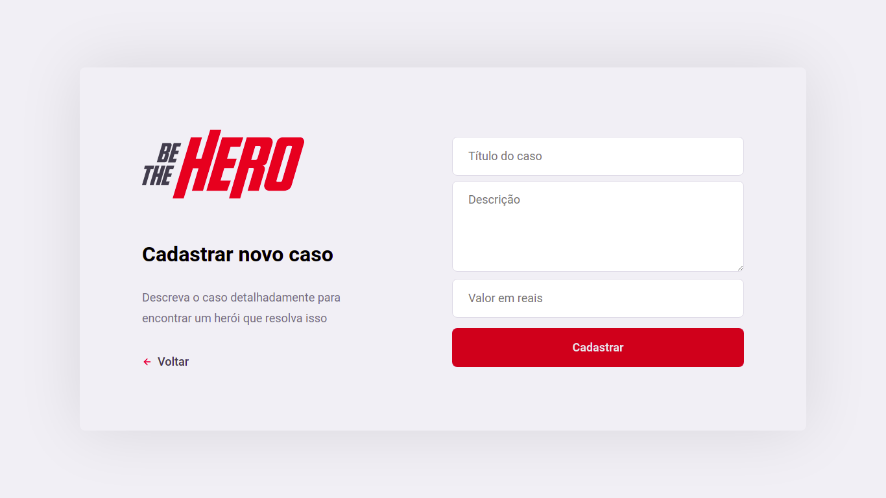

# Be The Hero

Tecnologias: Javascript, React, React Native, Node.js, SQLite3, HTML, CSS.

Objetivo: Conectar pessoas que estão dispostas a ajudar ONGs de maneira monetária.

Obs.: Desenvolvido durante a Semana OmniStack 11 da Rocketseat.

 

 

